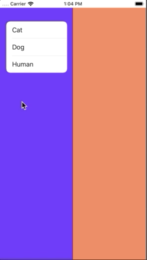
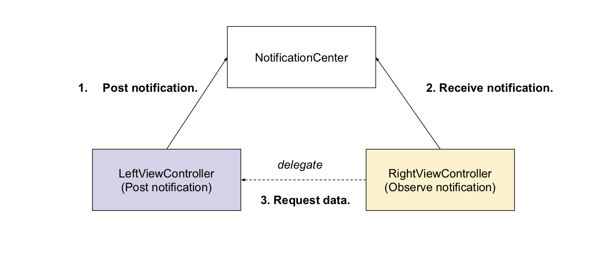

# ViewControllersContainer
This is the demo app which present the usage of childViewControllers.

## ChildViewControllerDemo Intro
The app consist of a view controller which contained two child table view controllers.
When user tapped cells in the left view controller, the amount of cells in the right view controllers will increase.
You can find the demo video below.   



## Architecture
Used MVC for simple pattern simple architecture, this demo just focused on `ChildViewController` & `Data transition` practice.

## Concept
**How to put multi-view controllers inside a UIView?**
   1. In the view controller, setup two container views in fixed position (left and right).
   2. Generate left and right view controllers, then set the left and right view controller as child view controller.
   3. Add left and right controller's view as subview.
   4. Setup constraint for subviews.   
```swift
func setupUI() {
        let animalList = AnimalTableViewController.instance()
        let animalCategory = AnimalCategoryTableViewController.instance()
        animalList.view.backgroundColor = #colorLiteral(red: 0.3647058904, green: 0.06666667014, blue: 0.9686274529, alpha: 1)
        animalCategory.view.backgroundColor = #colorLiteral(red: 0.9411764741, green: 0.4980392158, blue: 0.3529411852, alpha: 1)
        addChild(animalList)
        animalList.didMove(toParent: self)
        animalList.view.translatesAutoresizingMaskIntoConstraints = false
        leftContainerView.addSubview(animalList.view)
        
        let views: [String: Any] = [
        "animalList": animalList.view!,
        "animalCategory": animalCategory.view!]
        let options: NSLayoutConstraint.FormatOptions = [.alignAllCenterX]
        var constraint = NSLayoutConstraint.constraints(withVisualFormat: "H:|-0-[animalList]-0-|", options: options, metrics: nil, views: ["animalList": animalList.view!])
        constraint += NSLayoutConstraint.constraints(withVisualFormat: "V:|-0-[animalList]-0-|", options: options, metrics: nil, views: views)
        
        animalCategory.animalDataSource = animalList
        addChild(animalCategory)
        animalCategory.didMove(toParent: self)
        rightContainerView.addSubview(animalCategory.view)
        
        animalCategory.view.translatesAutoresizingMaskIntoConstraints = false
        var constraint2 = NSLayoutConstraint.constraints(withVisualFormat: "H:|-0-[animalCategory]-0-|", options: options, metrics: nil, views: ["animalCategory": animalCategory.view!])
        constraint2 += NSLayoutConstraint.constraints(withVisualFormat: "V:|-0-[animalCategory]-0-|", options: options, metrics: nil, views: views)

        NSLayoutConstraint.activate(constraint)
        NSLayoutConstraint.activate(constraint2)
    }
```

**The proper way to communicate between the left view controller and the right view controller?**   
Since the rule is tap left controller will change the right controller's amount of cells. We will adopt `notification` and `delegate` patterns when the user tapped the left view controller, the left controller will post a notification. Then the right view controller registers self as an observer in `NotificationCenter` when the right view controller received the notification event, it will call its delegate (in this demo the delegate is left view controller) to retrieve the selected value.

**LeftViewController**
```swift
    override func tableView(_ tableView: UITableView, didSelectRowAt indexPath: IndexPath) {
        tableView.deselectRow(at: indexPath, animated: true)
        selectedAnimal = animals[indexPath.row]
        let notificationName = Notification.Name("AnimalChaged")
        NotificationCenter.default.post(name: notificationName, object: nil)
    }
```
**RightViewController**
```swift
    override func viewDidLoad() {
        super.viewDidLoad()
        tableView.register(UITableViewCell.self, forCellReuseIdentifier: "cell")
        let notificationName = Notification.Name("AnimalChaged")
        NotificationCenter.default.addObserver(self, selector: #selector(animalSelected), name: notificationName, object: nil)
    }
    @objc func animalSelected() {
        animals.append(animalDataSource.animal())
        refreshTable()
    }    
```

## Data Transition

The reason that adopted this pattern is the `Notification` is a one way one to many communication but the `Delegate` is a one to one two way communication.
In this scenario is suitable to transition data between view controllers by these patterns.

## Author
[Wayne Hsiao](mailto:chronicqazxc@gmail.com)
